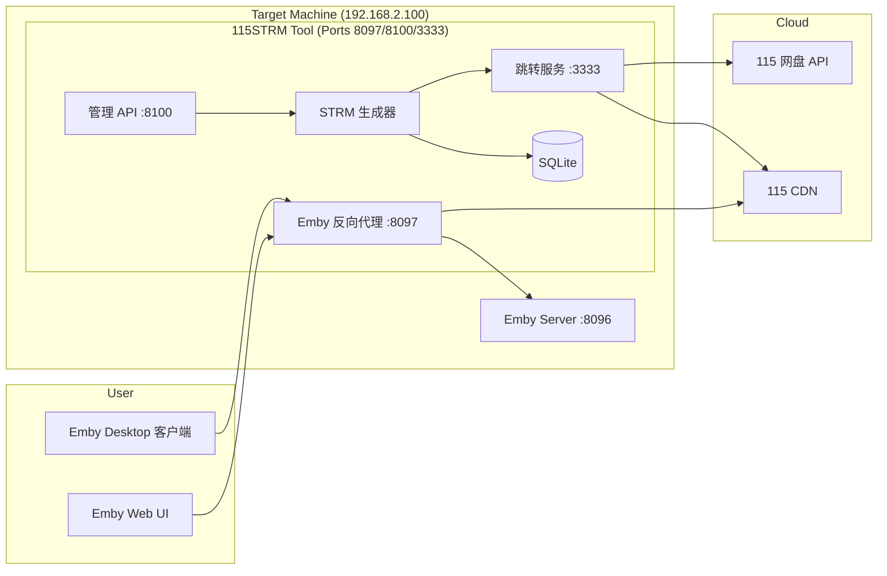
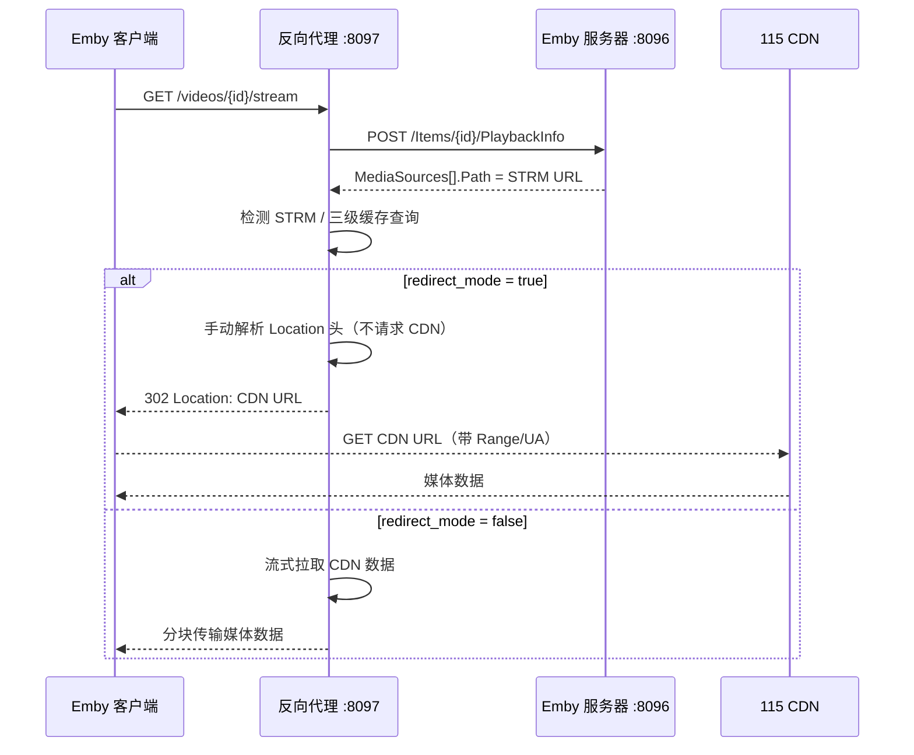
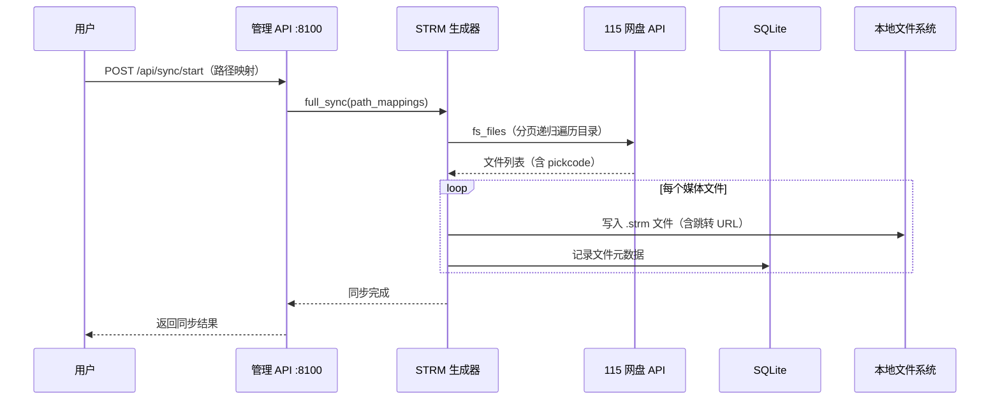

# 系统架构

## 概述

115网盘STRM生成与302工具是一个面向 Windows 桌面用户的媒体流代理工具，解决 Emby 媒体服务器播放 115 网盘中视频文件时的转码和跨域问题。用户通过 Emby Web UI 或客户端直接播放 115 网盘中的影片，无需中转下载。

系统将 115 网盘的目录结构映射为本地 Emby 媒体库路径，生成 STRM 占位文件，并在播放时通过 302 重定向让客户端直连 115 CDN 下载媒体流。同时提供了管理 Web UI、二维码登录、外部播放器注入等配套能力。

## 技术栈

**语言与运行时**
- Python 3.12
- PyInstaller（单文件 exe 分发）

**框架**
- FastAPI / Starlette — REST API 与反向代理
- Uvicorn — ASGI 服务器
- httpx — 异步 HTTP 客户端（HTTP/2 支持）
- websockets — WebSocket 双向代理

**数据存储**
- SQLite — STRM 文件清单、同步历史、离线任务
- JSON — 配置文件

**外部依赖（Wheels）**
- p115client — 115 网盘 SDK
- p115rsacipher — RSA 加密/解密
- p115cipher — 115 加解密
- p115oss / p115pickcode — 115 OSS 与 pickcode 工具

**可选 Windows 集成**
- pystray — 系统托盘
- Pillow — 托盘图标
- webview / pywebview — 原生 WebView2 窗口
- pywin32 — Windows 注册表（开机自启）

**基础设施**
- Windows 桌面（单机部署）
- GitHub Actions — CI/CD 构建与发布

## 项目结构

```
MoviePilot-Windows/
├── combined/                   # 主应用包
│   ├── main.py                 # 应用入口点与服务编排
│   ├── proxy_app.py            # Emby 反向代理核心
│   ├── redirect_service.py     # 115 CDN URL 跳转服务
│   ├── strm_generator.py       # STRM 文件生成器
│   ├── p115_client_wrapper.py  # 115 网盘 API 客户端封装
│   ├── api_routes.py           # P115 REST API 端点
│   ├── admin_api.py            # 管理面板 REST API
│   ├── external_players.py     # 外部播放器注入系统
│   ├── config_manager.py       # JSON 配置管理
│   ├── database.py             # SQLite 持久化层
│   ├── windows_tray.py         # Windows 系统托盘与原生窗口
│   ├── logger.py               # 日志设置
│   ├── build_exe.py            # PyInstaller 构建脚本
│   ├── web/
│   │   └── index.html          # 管理控制面板 SPA
│   ├── requirements.txt        # 依赖清单
│   └── wheels/                 # 35+ 预构建 Wheels
├── .github/workflows/
│   └── release.yml             # CI/CD 构建与发布
└── .monkeycode/docs/           # 项目文档
```

**入口点**
- `combined/main.py` — 应用启动入口
- `combined/build_exe.py` — PyInstaller 构建脚本

## 子系统

### 管理 API 服务器（端口 8100）
**目的**: 提供 Web 管理控制面板和 REST API
**位置**: `combined/api_routes.py` + `combined/admin_api.py`
**关键文件**: `main.py`（通过 `create_admin_app()` 组装路由）
**依赖**: `config_manager`, `p115_client_wrapper`, `strm_generator`, `database`
**被依赖**: 用户浏览器访问管理 UI

### Emby 反向代理（端口 8097）
**目的**: 代理 Emby 请求、拦截 PlaybackInfo 强制 DirectPlay、302 重定向（默认）或流式代理两种模式，将 115 CDN 媒体流返回客户端
**位置**: `combined/proxy_app.py`
**关键文件**: `proxy_app.py`（最大模块）
**依赖**: `external_players`, `config_manager`, `redirect_service`
**被依赖**: Emby 客户端（浏览器/桌面）
**配置项**: `redirect_mode` — `true` 为 302 直链模式，`false` 为流式代理模式

### 115 跳转服务（端口 3333）
**目的**: 为 STRM 文件中的 pickcode 解析 115 CDN 下载地址，支持 UA 绑定的加密下载 API（优先）和 SDK 下载（降级兜底）
**位置**: `combined/redirect_service.py` + `p115_client_wrapper.py`
**关键文件**: `redirect_service.py`, `p115_client_wrapper.py`
**依赖**: `p115rsacipher`, `p115client`
**被依赖**: `strm_generator`（写入 STRM 时使用此服务地址），`proxy_app`（播放时解析跳转）

### STRM 文件生成器
**目的**: 遍历 115 网盘目录，为媒体文件生成 STRM 占位文件
**位置**: `combined/strm_generator.py`
**依赖**: `p115_client_wrapper`, `database`, `config_manager`
**被依赖**: 管理 API（用户触发同步）

### 持久化层
**目的**: 存储 STRM 清单、同步历史、离线任务
**位置**: `combined/database.py` + `combined/config_manager.py`
**关键文件**: `database.py`（SQLite）, `config_manager.py`（JSON 配置）

## 图表

### 系统架构



### 媒体播放请求流程



### STRM 生成流程



## 设计决策

### 302 重定向 + crossOrigin 拦截
`_try_media_response` 解析 STRM URL 后，根据 `redirect_mode` 配置决定返回 302 重定向或流式代理。302 模式下客户端直连 115 CDN，媒体流量不经过代理服务器。Web 浏览器跟随跳转直接访问 CDN 可能触发 CORS 拦截，通过注入 `CROSS_ORIGIN_INTERCEPT_SCRIPT` 脚本覆盖 `HTMLMediaElement.prototype.crossOrigin` 为 null，并配合 `basehtmlplayer.js` 和 `plugin.js` 的 crossOrigin 赋值修补来消除跨域问题。流式代理 `_stream_from_cdn` 保留作为备选方案。

### 手动解析 Location 头（302 模式）
`_resolve_redirect` 使用 `follow_redirects=False` 发起 HEAD 请求，手动解析响应 `Location` 头获取 CDN URL，避免实际请求 CDN。这是为了防止 CDN 拒绝 HEAD 请求（405 Method Not Allowed）或返回方法绑定的签名 URL，导致客户端后续 GET Range 请求失败。

### UA 绑定的加密下载 API
115 CDN 的下载 URL 与请求时的 User-Agent 绑定。使用 `p115rsacipher` 加密 `pick_code`，通过 `proapi.115.com/android/2.0/ufile/download` 接口获取 URL，确保 URL 与客户端 UA 一致。

### PlaybackInfo 强制 DirectPlay
Emby 默认可能对远程媒体源启用转码（HLS），导致 302 直链失效。代理拦截 `/Items/{item_id}/PlaybackInfo`，检测 STRM 媒体源后将 `SupportsTranscoding` 设为 false，强制 DirectPlay。同时替换 `MediaSources[].Path` 为 CDN 直链，兼容使用 `Path` 而非 `DirectStreamUrl` 播放的客户端（如王二小放牛娃）。

### JS 修补与 crossOrigin 拦截
代理注入两个脚本到 Emby Web UI：
1. `crossOrigin` 拦截器——覆盖 `HTMLMediaElement.prototype.crossOrigin` 为 null
2. 修补 `basehtmlplayer.js` 和 `plugin.js`——移除 crossOrigin 赋值语句