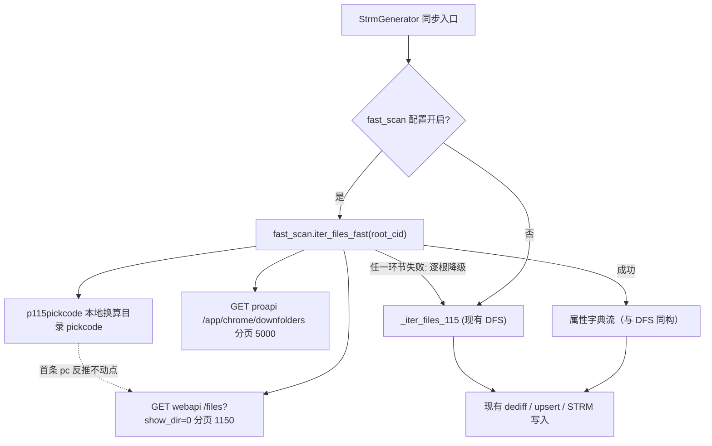

# 快速整树扫描

Feature Name: fast-recursive-scan
Updated: 2026-10-04

## Description

将同步依赖的网盘遍历从逐目录 DFS 升级为"递归文件列表 + 递归目录表"两条分页端点流，请求数由 O(目录数) 降为每根约 2~5 次；未公开端点失效时逐根自动降级回 DFS。同步 diff、STRM 写入与既有数据库结构零改动。

需求文档：当前工作区 `.monkeycode/specs/fast-recursive-scan/requirements.md`

## Architecture



要点：

1. 新模块 `combined/fast_scan.py`，只依赖 wrapper 暴露的 HTTP session 与 client 实例；不引入新第三方依赖
2. `StrmGenerator` 在遍历处按配置选择 `fast_scan.iter_files_fast` 或 `_iter_files_115`，两条路径产出同构属性字典后进同一 diff；取消信号与进度回调透传
3. 递归文件列表走 webapi（115-station 同款参数 `aid=1&show_dir=0&o=user_ptime&asc=0&limit=1150`）；属性规范化交给 `p115client.tool.attr.normalize_attr`（其为 web 形态设计），失败即降级，不自行解析字段
4. 不动点推导：取首文件页任一 `pc` → `p115pickcode.get_stable_point(pc)` → `p115pickcode.id_to_pickcode(root_cid, stable_point)` 得目录 pickcode，零额外请求；首页空页或推导失败 → 该根降级
5. 目录表 `fid/fn/pid` 建 `cid → (名字, 父 cid)` 映射，自底向上拼相对路径补全文件 `pan_path`；映射缺父时该文件走降级（宁降级不猜路径）

## Components and Interfaces

`combined/fast_scan.py`（新增）:

```python
def iter_files_fast(
    client_wrapper: P115ClientWrapper,
    root_cid: int,
    cooldown: float = 1.0,
    cancellation: Optional[threading.Event] = None,
    progress: Optional[Callable[[int, int], None]] = None,
) -> Iterator[Dict[str, Any]]:
    """
    快速整树遍历，产出与 _iter_files_115 同构的属性字典；
    不可用时抛出 FastScanUnavailable，由调用方降级
    """

class FastScanUnavailable(Exception):
    """快速扫描不可用（端点失败、结构异常、pickcode 不可推导、映射缺失），触发调用方降级"""
```

`P115ClientWrapper` 扩展（既有类新增两个只读辅助）:

```python
def webapi_get_json(self, path: str, params: Dict[str, Any]) -> Dict[str, Any]:  # 带冷却与 405 检测
def proapi_get_json(self, path: str, params: Dict[str, Any]) -> Dict[str, Any]:  # android UA
```

`combined/strm_generator.py` 修改点（全量与增量各一处）：

```python
scanner = iter_files_fast if self._fast_scan else _iter_files_115
# 全量循环与增量循环中 try/except FastScanUnavailable -> logger.warning + 历史 message 追加降级说明 + 回退 _iter_files_115
```

`combined/config_manager.py`：新增配置项 `fast_scan`（bool，默认 `True`），随既有校验/持久化链路；管理面板同步设置区加一个复选框（复用现有布尔配置渲染）

## Data Models

无数据库模式变更。内存结构：

- `dir_map: Dict[int, Tuple[str, int]]` — `目录cid -> (目录名, 父目录cid)`，根目录父指向自身终止
- 文件页条目仅消费 `cid`（父目录）与 `pc/sha1/name/size`（经 normalize_attr 归一后字段）

## Correctness Properties

1. **等价性**：同一子树快照下，快速扫描与 DFS 产出集合（`pickcode -> (name, size, sha1, path)`）相等——以同一份 115-station 风格 fixture（文件页 JSON + 目录表 JSON + 对应 DFS 序列）做对照测试验证
2. **降级完备性**：任一快速扫描异常路径的最终行为 = 关闭开关的行为（属性流来源替换，diff 与写库不变）
3. **取消及时性**：`cancellation` 置位后，正在分页的循环在下一次迭代边界退出，不产生半写入属性流之外的副作用（diff 幂等，由既有 upsert 保证）

## Error Handling

| 场景 | 行为 |
| ---- | ---- |
| 文件页请求失败 / state=false / 4xx / 405 | 抛 `FastScanUnavailable`，该根降级，WARNING + 同步历史 message |
| pickcode 不可推导（首页无可用 pc 或库异常） | 同上 |
| 目录映射缺父 cid | 同上（整根降级，不做部分修补） |
| 空页但 count 未到 | 结束该端点流，WARNING，继续 diff（视同扫描时刻视图） |
| 目录表页数超上限 500 页 | 降级，视为端点异常 |
| 冷却 | 复用 wrapper 现有 endpoint cooldown 机制，两类端点各自串行 |

## Test Strategy

新增 `combined/test_fast_scan.py`（用 `stub_modules`/`stub_missing` 复用 conftest）：

1. 合成 fixture：3 层目录 + 跨页文件（含 >1150 触发翻页），mock HTTP 层 → 断言属性流与手算期望一致（等价性）
2. 与现有 `_iter_files_115` 的 mock 序列对照，断言两路输出集合相等（正确性属性 1）
3. pickcode 推导：注入 known `pc` → 断言只调用 p115pickcode 不发额外请求；空页 → 抛 `FastScanUnavailable`
4. 降级触发矩阵：state=false、HTTP 5xx、目录映射缺失、页数超限 → 分别断言异常类型与日志/历史 message（正确性属性 2）
5. 取消与进度：中途置位 Event → 断言提前返回且 progress 单调
6. 集成回归：现有 140 用例不改语义（开关默认开但 mock 环境快速路径会走 unavailable → 自动降级路径，若因此影响既有用例则在测试配置中显式关闭）

## References

[^1]: (Filename) - [115-station fast115.go](https://github.com/pancras-loe/115-station/blob/master/internal/api/fast115.go)
[^2]: (Filename) - [115-station pickcode115.go](https://github.com/pancras-loe/115-station/blob/master/internal/api/pickcode115.go)
[^3]: (Filename#L33) - 本项目 `combined/strm_generator.py` `_iter_files_115`
